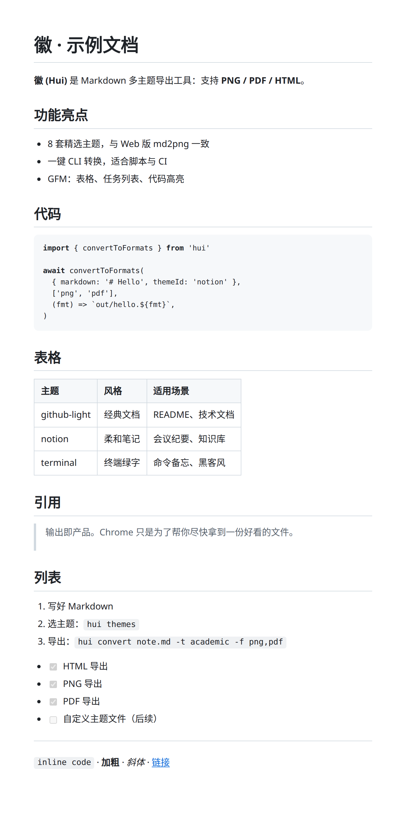
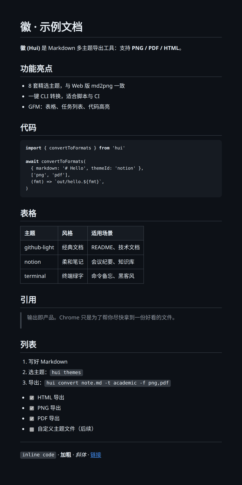
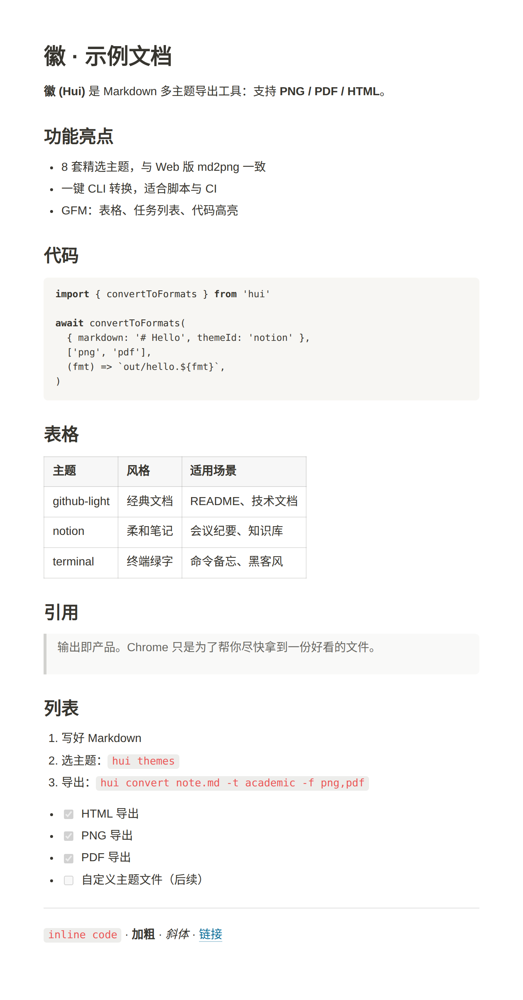
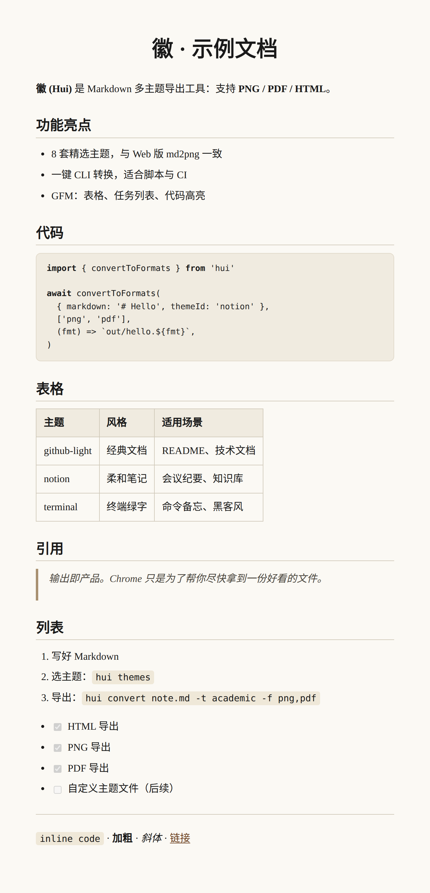
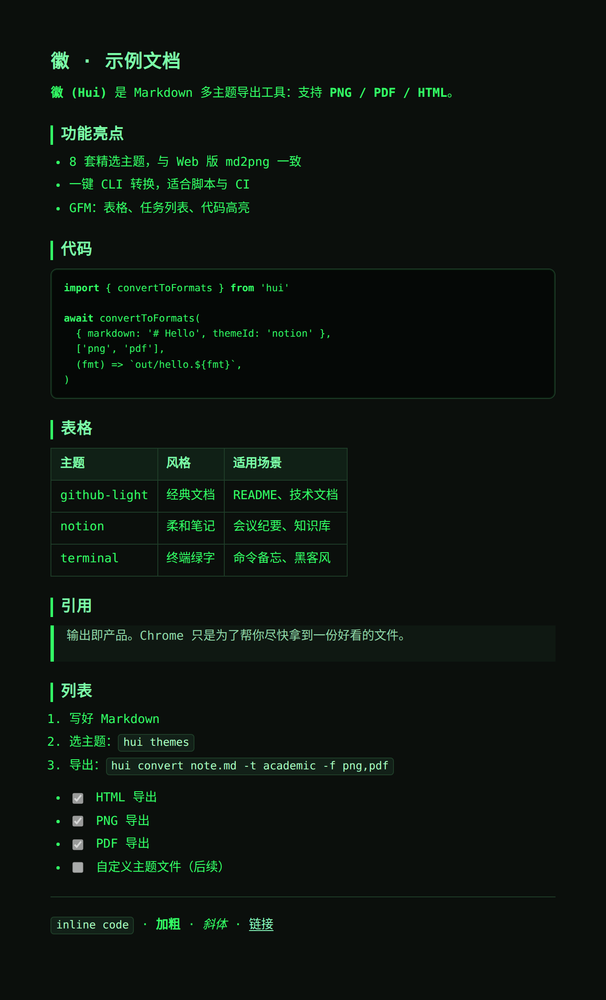
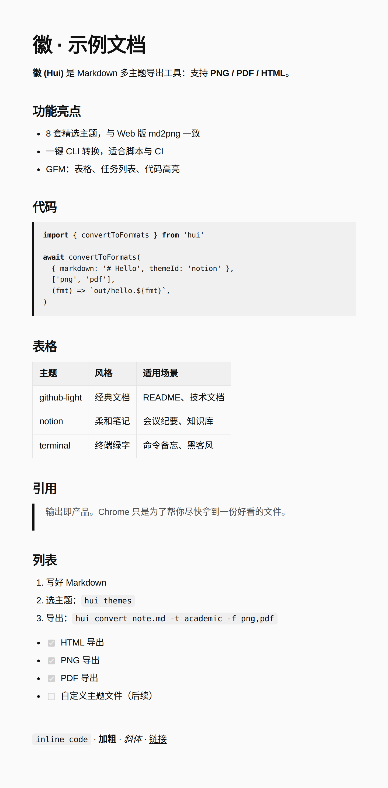
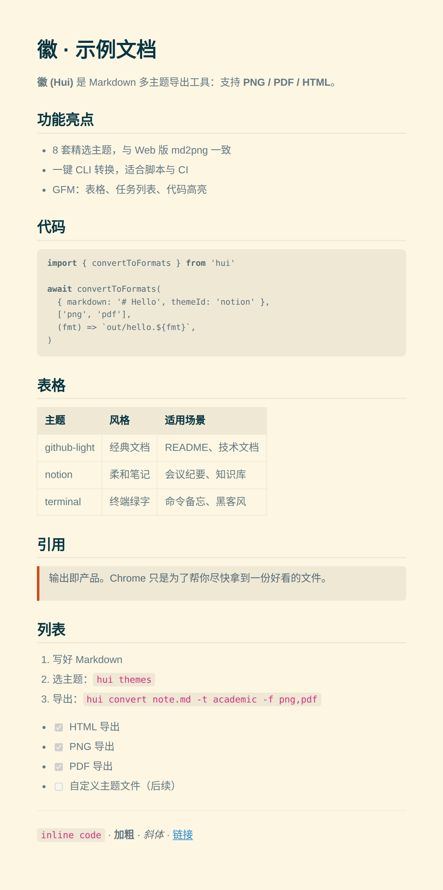
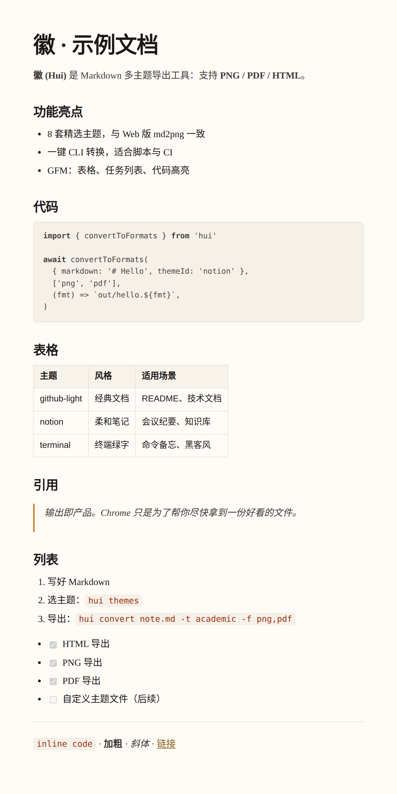

# 徽 (Hui) CLI

[English](README.md) | 中文

**徽** — 将 Markdown 快速转换为 **PNG / PDF / HTML**，支持多主题切换。

主题体系与 [md2png](../md2png) Web 版一致：GitHub Light/Dark、Notion、Academic、Terminal、Minimal、Solarized、Newspaper。

## 安装

### Homebrew（推荐 macOS）

```bash
brew tap helson-lin/tap

# 已有 tap 时：强制同步到远程 main（不要 untap，以免卸掉 doke/of）
git -C "$(brew --repo helson-lin/tap)" fetch origin
git -C "$(brew --repo helson-lin/tap)" reset --hard origin/main

brew reinstall helson-lin/tap/hui
hui --version
```

若出现 `zsh: killed`（macOS 对未签名 / 签名损坏的 arm64 二进制直接 SIGKILL）：

```bash
# 方案 A：同步 tap 后重装（install 阶段会 ad-hoc codesign + 跑 hui --version）
git -C "$(brew --repo helson-lin/tap)" fetch origin
git -C "$(brew --repo helson-lin/tap)" reset --hard origin/main
brew reinstall helson-lin/tap/hui
hui --version

# 方案 B：手动签名当前二进制
xattr -cr "$(brew --prefix)/bin/hui"
codesign --force --sign - --timestamp=none \
  --identifier com.helsonlin.hui "$(brew --prefix)/bin/hui"
hui --version
```

PNG / PDF 需要本机已安装 **Google Chrome** 或 **Chromium**（`puppeteer-core` 驱动系统浏览器，无需再下载 Playwright 浏览器）。

```bash
# 可选：指定浏览器路径
export HUI_CHROME_PATH="/Applications/Google Chrome.app/Contents/MacOS/Google Chrome"
```

### 从源码

```bash
cd ~/project/hui
npm install
npm run build
npm link   # 可选：全局注册 hui 命令
# PNG/PDF：系统需有 Chrome/Chromium
```

开发模式（无需 build）：

```bash
npm run hui -- convert examples/sample.md -f html
```

### 发布二进制 / GitHub Release

打 `v*.*.*` 标签后，[`.github/workflows/release.yml`](.github/workflows/release.yml) 会：

1. `bash build.sh`：esbuild 打包 + `@yao-pkg/pkg` 生成多平台二进制  
2. 上传到 GitHub Release：`hui-<tag>-darwin-arm64.tar.gz` 等  
3. 更新 [homebrew-tap](https://github.com/helson-lin/homebrew-tap) 的 `hui.rb`（version / url / sha256，逻辑对齐 doke）

```bash
# 本地试打包（全部平台，需时较长）
bash build.sh v1.0.0
# 产物在 release/

# 发布
git tag v1.0.0
git push origin v1.0.0
```

**仓库 Secret（与 doke 相同）**

| Secret | 用途 |
|--------|------|
| `TOKEN` | GitHub PAT：写本仓库 Release + 推送 `homebrew-tap` |

首次使用前把 `homebrew/hui.rb` 拷到 tap 仓库根目录（或让 CI 在缺失时自动 seed）。

## 用法

```bash
# 转 HTML（默认）
hui convert note.md

# 指定主题与格式
hui convert note.md -t notion -f png
hui convert note.md -t academic -f pdf -p A4
hui convert note.md -t terminal -f html,png,pdf -o dist/note

# 快捷：省略 convert 子命令
hui note.md -t solarized -f png -o out/shot.png

# ── 批量目录 ──
# 当前目录下所有 .md → 默认写回同目录 HTML
hui convert ./notes

# 递归子目录，导出 PNG 到 out/（保留相对路径）
hui convert ./notes -r -t notion -f png -o ./out

# 多格式批量
hui convert ./docs -r -f html,pdf -t academic -o ./dist

# 遇错即停（默认跳过失败文件继续）
hui convert ./notes -r -f png -o ./out --fail-fast

# 列出主题
hui themes
hui themes --json
```

### 批量说明

| 输入 | 行为 |
|------|------|
| 文件 `a.md` | 单文件转换 |
| 目录 `notes/` | 扫描该层 `*.md` / `*.markdown` |
| 目录 + `-r` | 递归子目录；自动跳过 `node_modules`、`.git`、`dist` 等 |

- **`-o` 在批量时始终视为输出目录**，并按相对路径镜像：`notes/a/b.md` → `out/a/b.png`
- 未指定 `-o` 时，产物写在每个源文件旁边
- PNG/PDF 批量共享同一个 Chromium 会话，比逐文件启动更快
- 有文件失败时退出码为 `1`；默认继续处理其余文件

### 选项

| 选项 | 说明 | 默认 |
|------|------|------|
| `-o, --output` | 输出路径（单文件可含扩展名；批量为目录） | 与输入同目录同名 |
| `-f, --format` | `html` / `png` / `pdf`，可逗号组合 | 单文件可由 `-o` 推断，否则 `html` |
| `-t, --theme` | 主题 id | `github-light` |
| `-p, --page` | `A4` 或 `Letter` | `A4` |
| `--title` | HTML 文档标题（仅单文件） | 输入文件名 |
| `--width` | PNG 内容宽度（px） | `794` |
| `--scale` | PNG 设备像素比 | `2` |
| `-r, --recursive` | 目录批量时递归子目录 | 关 |
| `--fail-fast` | 批量遇错即停 | 关 |

### 主题 id

| id | 名称 | 说明 |
|----|------|------|
| `github-light` | GitHub Light | 经典文档风 |
| `github-dark` | GitHub Dark | 暗色代码风 |
| `notion` | Notion | 笔记柔和风 |
| `academic` | Academic | 论文排版 |
| `terminal` | Terminal | 终端绿字 |
| `minimal` | Minimal | 极简留白 |
| `solarized` | Solarized | 护眼配色 |
| `newspaper` | Newspaper | 编辑部风格 |

别名：`light` → github-light，`dark` → github-dark，`paper` → newspaper。

### 主题效果

示例文档：[`examples/sample.md`](examples/sample.md)。生成命令：

```bash
hui convert examples/sample.md -t <theme-id> -f png -o docs/themes/<theme-id>.png
```

| GitHub Light (`github-light`) | GitHub Dark (`github-dark`) |
|:---:|:---:|
|  |  |

| Notion (`notion`) | Academic (`academic`) |
|:---:|:---:|
|  |  |

| Terminal (`terminal`) | Minimal (`minimal`) |
|:---:|:---:|
|  |  |

| Solarized (`solarized`) | Newspaper (`newspaper`) |
|:---:|:---:|
|  |  |

## 作为库使用

```ts
import { convertToFormats, buildHtmlDocument, listThemes } from 'hui'

const md = '# Hello\n\nFrom **徽**.'

// 仅 HTML 字符串
const html = buildHtmlDocument({
  markdown: md,
  themeId: 'notion',
  title: 'Hello',
})

// 写文件（png/pdf 会启动无头 Chromium）
await convertToFormats(
  { markdown: md, themeId: 'github-dark' },
  ['html', 'png', 'pdf'],
  (fmt) => `./out/hello.${fmt}`,
)

// 批量：共享浏览器
import { convertMany, findMarkdownFiles, mapBatchOutputBase } from 'hui'
import { readFile } from 'node:fs/promises'

const root = './notes'
const files = await findMarkdownFiles(root, { recursive: true })
const jobs = await Promise.all(
  files.map(async (inputPath) => ({
    inputPath,
    markdown: await readFile(inputPath, 'utf8'),
    outputBase: mapBatchOutputBase(inputPath, root, './out'),
  })),
)
await convertMany(jobs, {
  themeId: 'notion',
  formats: ['png', 'pdf'],
})
```

## Agent Skill

方便 AI（Grok / Claude / Codex 等）调用 Hui：

- 本仓库：[`.grok/skills/hui/SKILL.md`](.grok/skills/hui/SKILL.md)
- Grok 斜杠：`/hui`
- 可复制到用户技能目录：`~/.agents/skills/hui/SKILL.md`

Skill 内含命令解析、单文件/批量转换、主题、Chrome 依赖与反模式，让 Agent 直接调用 `hui`，而不是自己重写导出逻辑。

## 技术栈

- Node.js ≥ 18 + TypeScript
- [marked](https://github.com/markedjs/marked) + [highlight.js](https://highlightjs.org/)
- [puppeteer-core](https://pptr.dev/) + 系统 Chrome/Chromium（PNG / PDF）
- [commander](https://github.com/tj/commander.js)
- 发布：esbuild + [@yao-pkg/pkg](https://github.com/yao-pkg/pkg) → 多平台二进制 / Homebrew

## 与 md2png 的关系

| | md2png (Web) | hui (CLI) |
|--|--------------|-----------|
| 场景 | 浏览器实时预览与导出 | 终端 / 脚本 / CI 批量转换 |
| 主题 | 8 套 | 同一套主题 CSS |
| 输出 | PNG / PDF / HTML | 相同 |

## 许可

MIT
